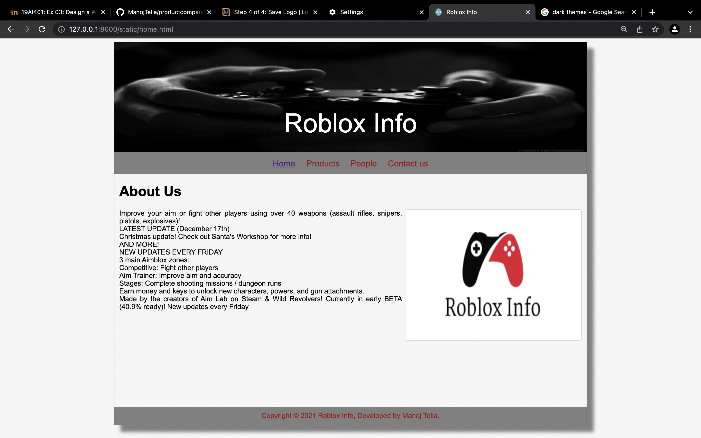
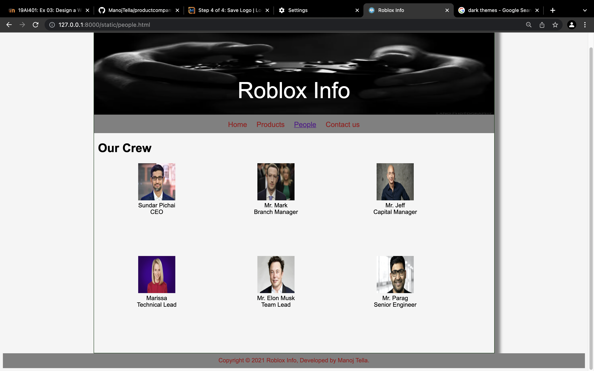
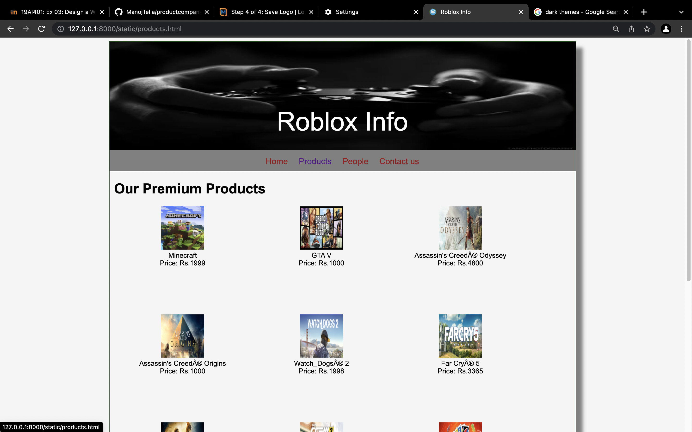
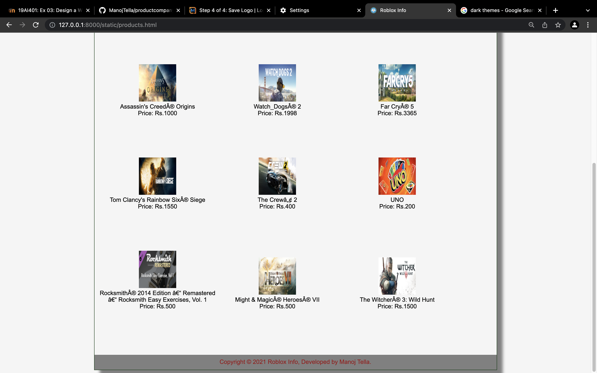

# Web Design for a Software Product Company

## AIM:

To design a static website for a software product company company.

## DESIGN STEPS:

### Step 1:

Requirement collection.

### Step 2:

Creating the layout using HTML and CSS.

### Step 3:

Updating the sample content.

### Step 4:

Choose the appropriate style and color scheme.

### Step 5:

Validate the layout in various browsers.

### Step 6:

Validate the HTML code.

### Step 6:

Publish the website in the given URL.

## PROGRAM :
### Home:
~~~
<!DOCTYPE html>
<html lang="en">
  <head>
    <title>Roblox Info</title>
    <link rel="stylesheet" href="./css/layout.css" />
    <link rel="icon" href="./img/icon.png" type="image/x-icon" />
  </head>

  <body>
    

      
Roblox Info

      

        
<a href="/static/home.html">Home</a>

        
<a href="/static/products.html">Products</a>

        
<a href="/static/people.html">People</a>

        
<a href="/static/contactus.html">Contact us</a>

      

      

        

          <h1>About Us</h1>
          
          

            Improve your aim or fight other players using over 40 weapons (assault rifles, snipers, pistols, explosives)!
             
            LATEST UPDATE (December 17th)
             
            Christmas update! Check out Santa's Workshop for more info!
             
            AND MORE!
             
            NEW UPDATES EVERY FRIDAY
             
            3 main Aimblox zones:
             
            Competitive: Fight other players
             
            Aim Trainer: Improve aim and accuracy
             
            Stages: Complete shooting missions / dungeon runs
             
            Earn money and keys to unlock new characters, powers, and gun attachments. 
             
            Made by the creators of Aim Lab on Steam & Wild Revolvers! Currently in early BETA (40.9% ready)! New updates every Friday
          

        

      

      

        Copyright &#169; 2021 Roblox Info, Developed by Manoj Tella.
      

    

  </body>
</html>
~~~
### People:
~~~
<!DOCTYPE html>
<html lang="en">
  <head>
    <title>Roblox Info</title>
    <link rel="stylesheet" href="./css/layout.css" />
    <link rel="icon" href="./img/icon.png" type="image/x-icon" />
  </head>

  <body>
    

      
Roblox Info

      

        
<a href="/static/home.html">Home</a>

        
<a href="/static/products.html">Products</a>

        
<a href="/static/people.html">People</a>

        
<a href="/static/contactus.html">Contact us</a>

      

      

        
    
          <h1>Our Crew</h1>
          

              
 
                  

                  
                  

                  
Sundar Pichai

                  
CEO

              

              
 
                  
 
                  
                  

                  
Mr. Mark

                  
Branch Manager 

              

              
 
                

                
                

                
Mr. Jeff

                
Capital Manager

            

            
 
              

              
              

              
Marissa

              
Technical Lead

          

          
 
            

            
            

            
Mr. Elon Musk

            
Team Lead

        

        
 
          

          
          

          
Mr. Parag

          
Senior Engineer 

      

        

        Copyright &#169; 2021 Roblox Info, Developed by Manoj Tella.
      

    

  </body>
</html>
~~~
### Contact:
~~~
<!DOCTYPE html>
<html lang="en">
  <head>
    <title>Roblox Info</title>
    <link rel="stylesheet" href="./css/layout.css" />
    <link rel="icon" href="./img/icon.png" type="image/x-icon" />
  </head>

  <body>
    

      
Roblox Info

      

        
<a href="/static/home.html">Home</a>

        
<a href="/static/products.html">Products</a>

        
<a href="/static/people.html">People</a>

        
<a href="/static/contactus.html">Contact us</a>

      

      

        

          <h1>Contact Us</h1>
       
          

           Mail us at  robloxinfo@gmail.com
            
           Contact us at 2233445566
            
           Our main office is at 4-199 opposite to clock tower,chaurastha building 5th floor.
          

        

      

      

        Copyright &#169; 2021 Roblox, Developed by Manoj Tella.
      

    

  </body>
</html>
~~~
### Products
~~~
<!DOCTYPE html>
<html lang="en">
  <head>
    <title>Roblox Info</title>
    <link rel="stylesheet" href="./css/layout.css" />
    <link rel="icon" href="./img/icon.png" type="image/x-icon" />
  </head>

  <body>
    

      
Roblox Info

      

        
<a href="/static/home.html">Home</a>

        
<a href="/static/products.html">Products</a>

        
<a href="/static/people.html">People</a>

        
<a href="/static/contactus.html">Contact us</a>

      

      

        
    
          <h1>Our Premium Products</h1>
          

              
 
                  

                  
                  

                  
Minecraft

                  
Price: Rs.1999

              

              
 
                  

                  
                  

                  
GTA V

                  
Price: Rs.1000 

              

              
 
                

                
                

                
Assassin's Creed® Odyssey

                
Price: Rs.4800

            

            
 
              

              
              

              
Assassin's Creed® Origins

              
Price: Rs.1000

          

          
 
            

            
            

            
Watch_Dogs® 2

            
Price: Rs.1998

        

        
 
          

          
          

          
Far Cry® 5

          
Price: Rs.3365 

      

      
 
        

        
        

        
Tom Clancy's Rainbow Six® Siege

        
Price: Rs.1550

    

    
 
      

      
      

      
The Crew™ 2

      
Price: Rs.400

  

  
 
    

    
    

    
UNO

    
Price: Rs.200

 
  

  
  

  
Rocksmith® 2014 Edition – Remastered – Rocksmith Easy Exercises, Vol. 1

  
Price: Rs.500

 
  

  
  

  
Might & Magic® Heroes® VII

  
Price: Rs.500

 
  

  
  

  
The Witcher® 3: Wild Hunt

  
Price: Rs.1500

        

        Copyright &#169; 2021 Roblox Info, Developed by Manoj Tella.
      

    

  </body>
</html>
~~~

## OUTPUT:
### Home:

### People:

### Contact:
![OUTPUT(contactus.png)
### Products

## Result:

Thus a website is designed for the software product company and the HTML,CSS code are validated.
